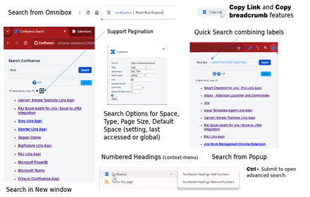

- [About](#about)
- [Options](#options)
  - [rooturl](#rooturl)
  - [Space Key](#space-key)
  - [Limit](#limit)
- [Search](#search)
  - [Query parameter](#query-parameter)
    - [Quick Open](#quick-open)
  - [Open results](#open-results)
- [Omnibox](#omnibox)
  - [Change the omnibox keyword](#change-the-omnibox-keyword)
- [Extension Keyword](#extension-keyword)
- [Context Menu](#context-menu)
  - [Numbering Headings](#numbering-headings)
- [How to submit an issue](#how-to-submit-an-issue)
- [How to support the developer or show appreciation](#how-to-support-the-developer-or-show-appreciation)

# About

This extension supports Confluence Cloud and Confluence Server variants.
It provides search capability and some additional functionality.

See [main blog post](https://tdalon.blogspot.com/2024/03/confluence-crx.html) and Blog posts labelled with [#confluence_crx](https://tdalon.blogspot.com/search/label/confluence_crx)

<a href="https://chrome.google.com/webstore/detail/confluence/dkofhaiegpbdikenaoljlbencjdbbpii">
  Chrome Webstore
  </a>

# Options

## rooturl

For Confluence Cloud it shall look like `https://${subdomain}.atlassian.net` (/wiki will be appended automatically)
You can only provide the subdomain string and the rooturl will automatically be expanded into `https://${subdomain}.atlassian.net/wiki`
You can leave out the https:// portion.
The first time you click on the extension button the options page will be opened so you can provide it.

You can open the options from the popup 'Options' button or from the Extension Action Menu.

Other options include:

## Default Space

If no space keyword is used the default space can be specified as:

* setting: the spaces defined in the options see next setting
* last accessed: the last accessed space key. It will look for the last Confluence tab opened in the current window and use the same space 
* global: no space filter / runs a global search 

## Space Key

You can enter multiple space keys separated by a comma (,). In this case it will search in the different spaces i.e. with an OR combination.
If no space key is entered, the search runs in your whole Confluence instance.

## Limit

This is the limit for the number of results returned by the search query. Default is 25. See doc [pagination](https://developer.atlassian.com/server/confluence/pagination-in-the-rest-api/).

# Search 

## Difference Cloud vs. Server/DataCenter

For Confluence DataCenter or Server-based variant it is not possible to grant permissions before-hand since we can not guess your Confluence domain url.
Therefore when entering a rooturl that does not match *.atlassian.net, the user will be asked to grant permissions.
The permission is only used for Read-access (Search API and extract Space from PageId).

## Query parameter

You can use # to prefix for labels.
If you enter multiple labels, it will search by labels with an AND combination. (Contrary to the built-in Confluence Advanced Search which search by OR combination.)

### Quick Open

If you use the keyword 'o' or ' -o' in the query to open the first match directly. (Quick Open feature) 

### Search Keywords

| **Keyword** | **Meaning**                                                                 |
|-------------|-----------------------------------------------------------------------------|
| `#`         | Prefix for labels. Searches by labels with an AND combination.             |
| `-s` or `s` | Search in space(s) with key defined in the Options                             |
| `-g` or `g` | Global search (all spaces)                             |
| `-l` or `l` | Search in last accessed space                            |

Last 3 space settings overwrite the space options.

## Open results

After a search you can quickly TAB to the results. Press ENTER to open the link.

## Multiple Spaces

In case you search in multiple spaces (eiter globally or because you have defined a list of Spaces (comma-separated) in the options), the space information will be displayed in the search results next to the result title.

# Omnibox

With the extension an omnibox keyword is implemented: It is the 'c' keyword.
In the omnibox, type 'c' followed by Space. It will complete into 'Confluence'. Then enter your search query as explained above.
(Using Tab instead of Space will prefill the omnibox with suggestions)

## Change the omnibox keyword

You can change the omnibox keyword in the [extension source](https://tdalon.blogspot.com/2020/10/chrome-extension-view-source.html).
(It is afaik not possible to set is as a user extension option.)

This is implemented in the manifest.json file:

"omnibox": {
      "keyword": "c"
   }

## Default Search used

You can change the omnibox search behavior to use the Confluence native Advanced Search in the options.
Otherwise it will open the extension search results page in the current tab.

## Omnibox Keywords

| **Keyword** | **Meaning**                                                                 |
|-------------|-----------------------------------------------------------------------------|                 |
| `-r` or `r`     | Opens the release notes.                                                   |
| `-h` or `h`       | Opens the help documentation.                                              |
| `-c`,`c` | Creates a new page in the specified space key or default. 
| `-n`,`n` | Quick navigate to specified space key or first default in settings.                             |

### Quick Create Page

The Quick Create Page feature will create a page in the default space depending on your settings or command arguments e.g. the spacekey provided after -s.

The page will be created in the home of the space so you will need to move it afterwards e.g. by Drag and Drop after `View in Hierarchy`.

### Quick Navigate to Space

To quickly open a Confluence Space you can use the `-n` or `n` keyword. You can also provide a specific spacekey after the `-s` flag. (lowercases works as well)

# Extension Keyboard Shortcuts

In the [extension keyboard shortcuts page](chrome://extensions/shortcuts), you can set a few shortcuts for example to open the popup search or [copy a link](#copy-link).

# Extension Action Context Menu

When you right-click on the Extension Icon (you can pin the extension to have the icon always visible.), it will open a menu with some actions.

The Copy Link function is available in the extension action menu. See documentation [below](#copy-link). 

# Context Menu

Some additional features are built-in in the Context Menu when you right-click on a page.

When you have a Confluence page opened in edit mode, you can access some functions via the Context menu (Right-Mouse Click). There are grouped under the extension menu "Confluence".

## Numbering Headings

You can add or remove numbering to headings using the corresponding menu entries.

See separate post [here](https://tdalon.blogspot.com/2024/03/crx-confluence-numbered-headings.html)

## Copy Link

You can access in the Browser "Copy Link" from a page context menu, the Extension Action menu or a keyboard shortcut setup in the extension settings.

Note: this works not only for Confluence pages. It will build a html link with the link text taken from the current Tab title. 
For Confluence pages, the url is transformed in case it is a Confluence url link by page title and not by page Id. (This makes the link robust to page renaming or moving.)

See separate blog post [here](https://tdalon.blogspot.com/2021/04/confluence-share-link.html) regarding motivation and implementation.

# How to submit an issue

You can submit an issue to report a bug or make a feature request using the [GitHub issues](https://github.com/tdalon/confluence_crx/issues) in the repository.

# How to support the developer or show appreciation

This extension is free and open source.
You can show your appreciation by [Buying me a coffee](https://www.buymeacoffee.com/tdalon).
