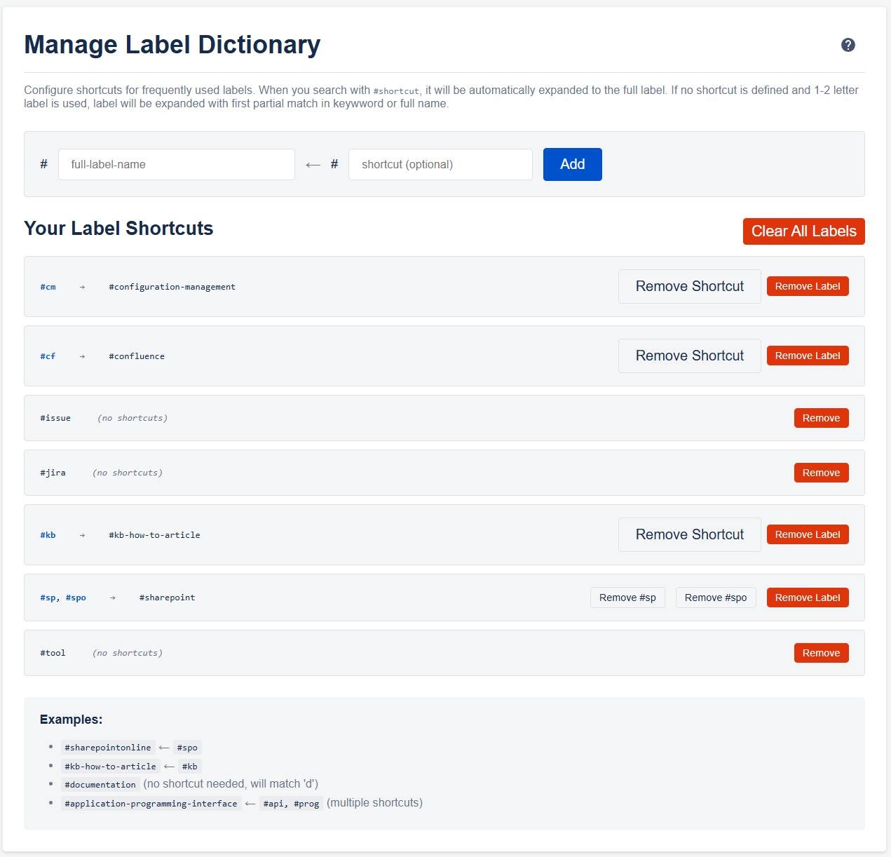

# Label Dictionary

The Label Dictionary feature allows you to create shortcuts for frequently used Confluence labels, making label-based searches faster and more consistent.

## Overview

The Label Dictionary helps you manage label shortcuts that automatically expand when used in Confluence searches. This feature is particularly useful for:
- Creating shortcuts for long or complex label names
- Ensuring consistent labeling terminology across team members
- Speeding up label-based searches

## Purpose

The Label Dictionary allows you to define shortcuts that expand to full label names when searching. For example:
- `#dev` → `#development`
- `#qa` → `#quality-assurance`
- `#pm` → `#project-management`
- `#kb` → `#kb-how-to-article` (from Confluence standard How-to Article Template)

When you search using the extension with `#dev`, it will automatically expand to `#development` in your search query.

## Managing Label Shortcuts

### Adding Label Shortcuts
1. Open the extension options (right-click extension icon → Options)
2. Click the "Label Dictionary" button on the bottom of the Options Page

Alternatively you can directly open the dictionary from the extension button context menu 'Label Dictionary'

3. Fill in the label details:
   - **Full Label**: The complete label name
   - **Shortcut**: A short abbreviation (optional, can be left empty)
4. Click "Add Label"

**Note:** You can add labels without shortcuts. When 1-2 letters are passed as label in the search, the label will be expanded looking for a partial match in the label name if no shortcut was matched (first exactly then partially).

### Multiple Shortcuts for One Label
You can create multiple shortcuts that point to the same full label:
- `#dev` → `#development`
- `#devel` → `#development`
- `#coding` → `#development`

### Removing Shortcuts
- **Single shortcut**: Click "Remove Shortcut" next to the specific shortcut
- **Entire label**: Click "Remove Label" to delete the label and all its shortcuts

## Using Label Dictionary in Search

When entering a label in the search, the extension will try to expand the label with following algorithm:
- First it will look for an exact match in the label shortcuts available in the dictionary
- If the label entered is short i.e. 1-2 letters only
  - it will look for a partial match in the label shortcuts in the dictionary
  - if no match is found, it will look for a partial match in the full labels available in the dictionary

For very short shortcuts (1-2 characters):
If you type #s, it will find the first shortcut or label starting with "s"
This is helpful when you can't remember the exact shortcut
This intelligent matching system makes the Label Dictionary flexible and forgiving, even when you only remember part of a shortcut.

