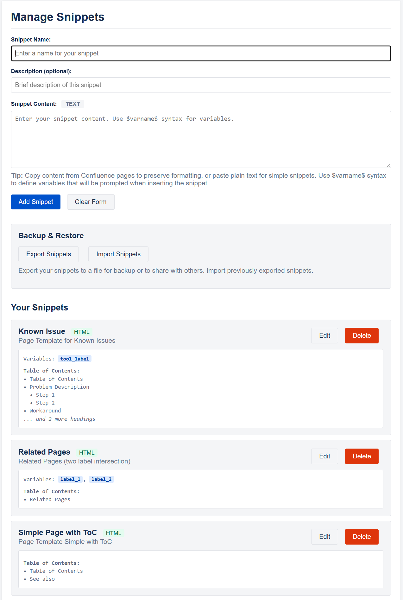
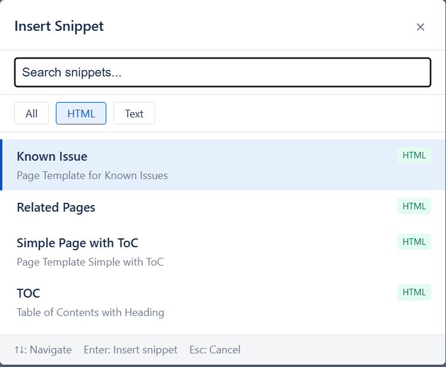

# Snippets

The Snippets feature allows you to store and quickly insert frequently used text snippets into Confluence pages while editing.

## Overview

Snippets are reusable text blocks that can be inserted into any editable field in Confluence. This is particularly useful for:
- Standard responses or templates
- Code blocks or configuration examples
- Frequently used formatting or markup
- Boilerplate text for documentation
- Variable-based templates with dynamic content

If you don't have admin rights to manage global or space templates, this is a convenient way to reuse templates across spaces from a non-admin user side.

## Managing Snippets

### Adding Snippets
1. Open the extension options (right-click extension icon → Options)
2. Click "Snippets" button on the bottom

Alternatively, you can open from the extension button context menu: Settings -> Snippets

3. Fill in the snippet details:
   - **Name**: A short, descriptive name for the snippet
   - **Description**: Optional description to help identify the snippet
   - **Content**: The actual text content to be inserted
4. Click "Add Snippet"

#### Snippet Content

Snippets support various content types:
- Plain text
- HTML markup (for rich formatting in Confluence)
- Confluence-specific markup
- Line breaks and special characters
- Variable placeholders using `$varname$` syntax

##### Variable Support
Snippets can include variables that prompt for input during insertion:
- Use `$variablename syntax to define variables
- Variables will prompt for values when the snippet is inserted
- Useful for templates with dynamic content like names, dates, or project-specific information or properties of macros (e.g. labels)

### Editing Snippets
1. In the Snippet Manager, find the snippet you want to edit
2. Click "Edit" next to the snippet
3. Modify the details as needed
4. Click "Save Changes"

### Deleting Snippets
#### Single snippet

Click "Delete" next to the specific snippet

#### Delete all

You can also delete all snippets from the `Delete All` Button next to the Imoort/Export buttons.
You will be asked for confirmation. 

It is recommended to make a backup by exporting before deleting.

## Accessing Snippets

You can access snippets in several ways:

### Context Menu (Right-click)
When editing a Confluence page:
1. Right-click in any editable area
2. Select "Insert Snippet" from the context menu
3. Choose your desired snippet from the submenu

### Quick Insert Snippet with Keyboard Shortcut
This is the much recommended way for quick inserting a snippet.

Set up a keyboard shortcut in Chrome's extension settings:
1. Go to `chrome://extensions/shortcuts`
2. Find "Confluence CRX" and set a shortcut for "Show Snippet Selector"
3. Use the shortcut while editing to open the snippet selector overlay

When using the Keyboard shortcut, it will open a Snippet Selector when you can quickly select the snippet to insert.
By default it recognizes if you are in the Source Editor or the Rich Editor and will properly filter the type of Snippet (text or html resp.)

You can navigate to the snippet with arrow keys and also filter/search for a snippet by text.

#### Snippet Selector

The snippet selector provides a searchable interface:
- **Search**: Type to filter snippets by name or description
- **Navigate**: Use ↑↓ arrow keys to navigate through results
- **Insert**: Press Enter or click to insert the selected snippet
- **Cancel**: Press Esc or click outside to close without inserting

## Import and Export

### Exporting Snippets
You can export your snippets to share with others or create backups:

1. Open the Snippet Manager
2. Click "Export Snippets" button
3. A JSON file will be downloaded with all your snippets
4. The filename includes the current date for easy organization

**Export file format:**
- Contains metadata (version, export date, extension name)
- Includes all snippet names, descriptions, and content
- Saved as a JSON file for easy sharing and version control

### Importing Snippets
You can import snippets from exported files:

1. Open the Snippet Manager
2. Click "Import Snippets" button
3. Select a valid JSON export file
4. Handle any conflicts with existing snippets:
   - **Overwrite All**: Replace all conflicting snippets with imported versions
   - **Skip Existing**: Keep current snippets, only add new ones
   - **Ask for Each**: Decide individually for each conflicting snippet
   - **Cancel**: Abort the import process

**Import features:**
- Validates file format before importing
- Detects and handles naming conflicts
- Shows import summary (imported count, skipped count)

### Sharing Snippets
To share snippets with team members:

1. Export your snippets using the "Export Snippets" button
2. Share the JSON file via email, file sharing, or version control
3. Recipients can import the file using "Import Snippets"

Consider creating team snippet libraries for common templates.
